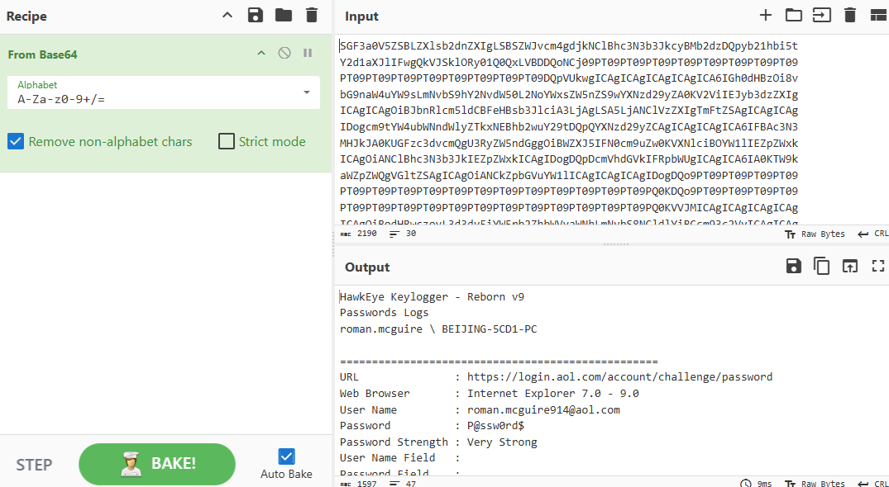

# PCAP-Analysis
Packet Capture analysis in Wireshark
 
 
# Wireshark Pcap Analysis: Stolen Credentials Investigation
This report details the analysis of the provided stealer.pcap file, simulating the process a security analyst would follow using Wireshark. The investigation revealed evidence of malicious activity, specifically the exfiltration of credentials via a keylogger.

🕵️‍♂️ Key Findings
The primary finding from the pcap file is the presence of a keylogger transmitting stolen data, including a username and password in clear text.

Identified Malware: The traffic analysis led to the discovery of a Base64-encoded string within the packet data. When decoded, the string explicitly mentions the "HawkEye Keylogger - Reborn v9". This confirms the system was compromised with a keylogger.

Stolen Credentials: The keylogger log contains the stolen credentials for an AOL account. The captured data includes the URL, username, and password.

URL: https://login.aol.com/account/challenge/password.

Username: roman.mcguire914@aol.com.

Password: P@ssw0rd$.

🌐 Network and System Context
The pcap file provides additional context about the compromised environment.
Domain Information: The network traffic is associated with a domain named PIZZAJUKEBOX.COM.
Host and User: The compromised machine is identified as BEIJING-5CD1-PC, and the affected user is roman.mcguire.

Kerberos Traffic: There are multiple Kerberos authentication requests and responses, which is typical traffic within a Windows domain environment.

📝 Analysis and Documentation Recap
Filter for Suspicious Traffic: A standard approach to this investigation would involve filtering the pcap file for protocols that often carry data in clear text, such as HTTP. Additionally, searching for keywords like "password" or "login" can help pinpoint suspicious packets.

Decoding Base64: A key step in this analysis was identifying a Base64-encoded string and decoding it using a tool called cyberchef. The string, once decoded, contained a log file from the keylogger, which explicitly revealed the stolen credentials.

Incident Response: This analysis confirms a security breach. The compromised account credentials are roman.mcguire914@aol.com and P@ssw0rd$. The compromised system is BEIJING-5CD1-PC within the PIZZAJUKEBOX.COM domain. The next steps for an incident response team would be to:

Immediately force a password reset for the roman.mcguire914@aol.com account.

Isolate the BEIJING-5CD1-PC host from the network to prevent further data exfiltration or lateral movement.

Perform a full forensic analysis of the compromised host to determine how the keylogger was installed and what other systems may have been affected.